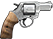

| ID | Weapon name | Picture |
|:--:|:-----------:|:-----------:|
| 2 | Model 12 Revolver |  |
| 3 | Mauser C96 |  |
| 4 | Colt M1911A1 |  |
| 5 | Colt M1911 Special |  |
| 6 | Model 19 Revolver |  |
| 7 | Grenade Sicily (does not explode) |  |
| 8 | Remington Model 870 Field gun |  |
| 9 | M3 Grease Gun |  |
| 10 | MP40 |  |
| 11 | Thompson 1928 |  |
| 12 | M1A1 Thompson |  |
| 13 | Beretta Model 38A |  |
| 14 | MG42 (Animation buggy, do not use) |  |
| 15 | M1 Garand |  |
| 16 | Stielhandgranate 24 (does not explode) |  |
| 17 | Kar98k |  |
| 18 | Mauser 98k sniper (missing model) |  |
| 20 | Grenade MkII |  |
| 21 | Molotov Cocktail |  |
