# SUMMER
| Name | Game Time | Real Time | Weather | Picture |
|:----:|:---------:|:---------:|:-------:|:-------:|
| DT_RTRclear_day_night | 0.000 | 0:00 | CLEAR |  |
| DTFreerideNight | 0.000 | 0:00 | CLEAR |  |
| DT07part04night_bordel | 0.000 | 0:01 | CLEAR |  |
| DT11part01 | 0.29431635141373 | 7:07 | FOGGY |  |
| DT_RTRfoggy_day_morning | 0.31002432107925 | 7:30 | FOGGY |  |
| DT_RTRfoggy_day_early_morn1 | 0.31392055749893 | 7:34 | FOGGY |  |
| DT_RTRclear_day_early_morn1 | 0.32031810283661 | 7:44 | CLEAR |  |
| DT_RTRrainy_day_early_morn | 0.32811683416367 | 7:56 | RAINING | 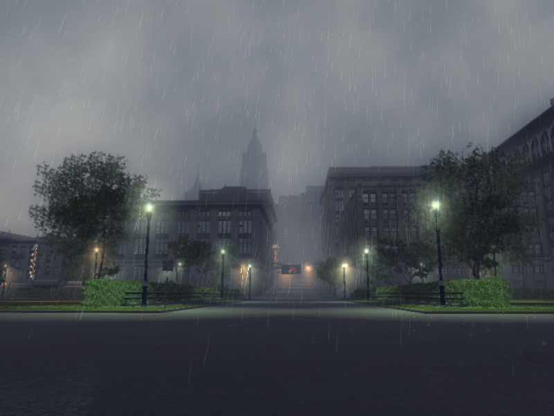 |
| DT07part01fromprison | 0.33852264285088 | 8:10 | CLEAR |  |
| DTFreeRideDay | 0.3412363529205 | 8:15 | CLEAR |  |
| DTFreeRideDayRain | 0.3410176932811 | 8:15 | RAINING |  |
| DT_RTRclear_day_early_morn2 | 0.34631487727165 | 8:22 | CLEAR |  |
| DT06part03 | 0.34821584820747 | 8:25 | CLEAR |  |
| DT_RTRrainy_day_morning | 0.36202752590179 | 8:45 | RAINING |  |
| DT06part02 | 0.39712086319923 | 9:36 | FOGGY |  |
| DT13part01death | 0.40371406078339 | 9:45 | CLEAR |  |
| DT_RTRclear_day_morning | 0.41677638888359 | 10:03 | CLEAR |  |
| DT09part1VitosFlat | 0.41681671142578 | 10:03 | CLEAR |  |
| DT06part01 | 0.42294234037399 | 10:12 | RAINING |  |
| DT11part02 | 0.42471653223038 | 10:15 | FOGGY |  |
| DT08part01cigarettesriver | 0.44792738556862 | 10:48 | CLEAR |  |
| DT09part2MalteseFalcone | 0.48262253403664 | 11:39 | CLEAR |  |
| DT_RTRclear_day_noon | 0.48993983864784 | 11:49 | CLEAR |  |
| DT_RTRfoggy_day_noon | 0.49064612388611 | 11:51 | FOGGY |  |
| DT14part1_6 | 0.50551474094391 | 12:12 | CLEAR |  |
| DT15 | 0.51041388511658 | 12:20 | RAINING |  |
| DT15end | 0.5104131102562 | 12:20 | RAINING |  |
| DT_RTRrainy_day_noon | 0.51822429895401 | 12:31 | RAINING |  |
| DT15_interier | 0.51881504058838 | 12:31 | FOGGY |  |
| DT07part02dereksubquest | 0.52875530719757 | 12:46 | CLEAR |  |
| DT_RTRfoggy_day_afternoon | 0.56521904468536 | 13:39 | FOGGY |  |
| DT10part02Roof | 0.56771916151047 | 13:42 | CLEAR |  |
| DT08part02cigarettesmill | 0.5765392780304 | 13:55 | CLEAR |  |
| DT09part3SlaughterHouseAfter | 0.57822239398956 | 13:58 | CLEAR |  |
| DT12_part_all | 0.58831542730331 | 14:13 | CLEAR |  |
| DT13part02 | 0.58851432800293 | 14:13 | CLEAR |  |
| DT01part01sicily_svit | 0.59381985664368 | 14:20 | CLEAR |  |
| DT_RTRrainy_day_afternoon | 0.59502381086349 | 14:23 | RAINING |  |
| DT09part4MalteseFalcone2 | 0.60071730613708 | 14:30 | CLEAR | 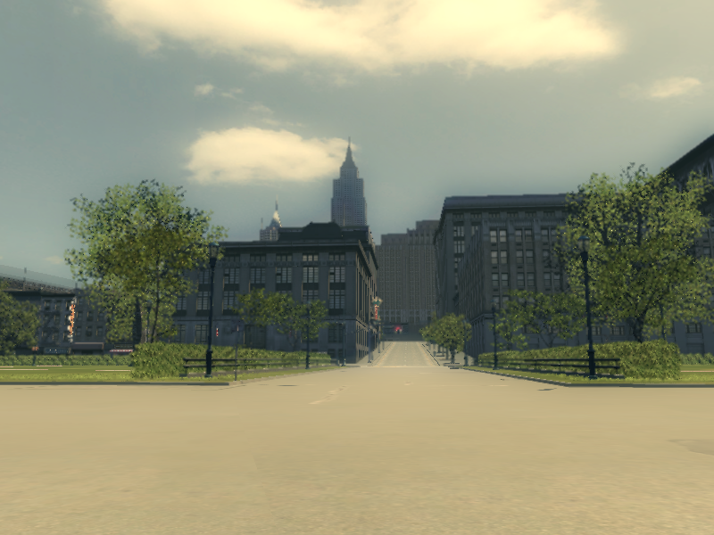 |
| DT_RTRclear_day_afternoon | 0.63298726081848 | 15:16 | CLEAR |  |
| DT11part03 | 0.64852559566498 | 15:40 | RAINING |  |
| DT_RTRfoggy_day_late_afternoon | 0.72542083263397 | 17:31 | FOGGY |  |
| DT_RTRclear_day_late_afternoon | 0.73442322015762 | 17:44 | CLEAR |  |
| DT_RTRrainy_day_late_afternoon | 0.73441541194916 | 17:44 | RAINING |  |
| DT14part7_10 | 0.73951333761215 | 17:52 | CLEAR |  |
| DT07part03prepadrestaurcie | 0.74481725692749 | 17:59 | CLEAR |  |
| DT_RTRrainy_day_evening | 0.75002640485764 | 18:07 | RAINING |  |
| DT10part03Evening | 0.75791400671005 | 18:18 | CLEAR |  |
| DT_RTRfoggy_day_evening | 0.79454433917999 | 19:11 | FOGGY |  |
| DT08part03crazyhorse | 0.79702144861221 | 19:16 | CLEAR |  |
| DT08part04subquestwarning | 0.80471169948578 | 19:26 | CLEAR |  |
| DT11part04 | 0.80812692642212 | 19:32 | RAINING |  |
| DT_RTRclear_day_evening | 0.8125171661377 | 19:37 | CLEAR |  |
| DT_RTRclear_day_late_even | 0.84381556510925 | 20:22 | CLEAR |  |
| DT_RTRfoggy_day_night | 0.84631955623627 | 20:27 | FOGGY |  |
| DT_RTRfoggy_day_late_even | 0.84734392166138 | 20:28 | FOGGY |  |
| DT_RTRrainy_day_late_even | 0.85161530971527 | 20:34 | RAINING |  |
| DT10part02bSUNOFF | 0.87504214048386 | 21:09 | CLEAR |  |
| DT10part03Subquest | 0.87861531972885 | 21:13 | FOGGY |  |
| DT01part02sicily | 0.91161644458771 | 22:01 | FOGGY |  |
| DT14part11 | 0.9297211766243 | 22:27 | CLEAR |  |
| DT_RTRrainy_day_night | 0.94797676801682 | 22:53 | RAINING |  |
| DT11part05 | 0.97131484746933 | 23:28 | CLEAR |  |

# WINTER
| Name | Game Time | Real Time | Weather | Picture |
|:----:|:---------:|:---------:|:-------:|:-------:|
| DTFreeRideNightSnow | 0.000 | 0:00 | CLEAR | 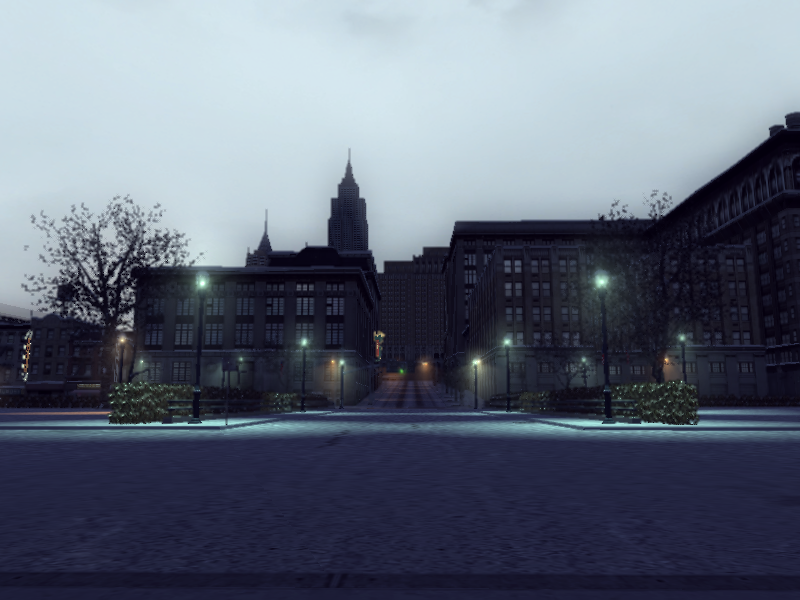 |
| DTFreeRideDaySnow | 0.3410138487815 | 8:15 | CLEAR | 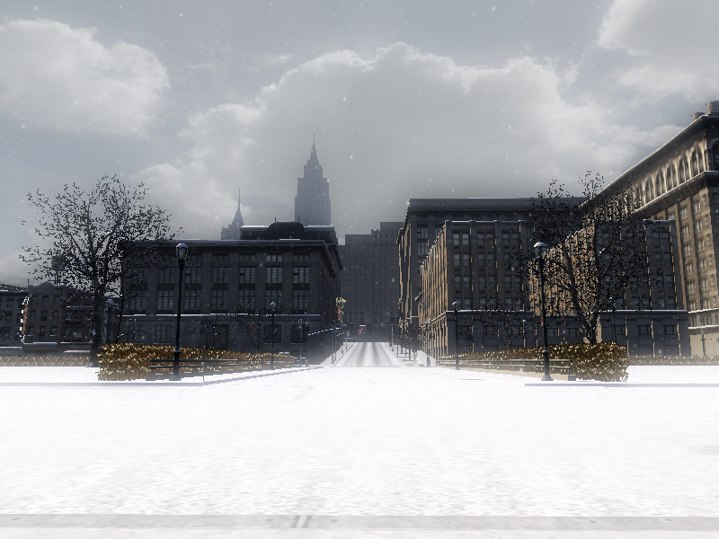 |
| DT05part01JoesFlat | 0.3759149312973 | 9:04 | CLEAR | 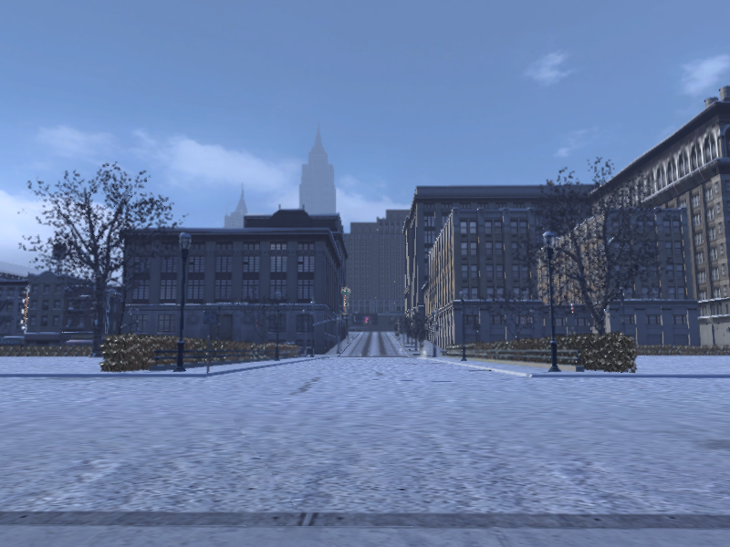 |
| DT05part02FreddysBar | 0.42721244692802 | 10:19 | CLEAR | 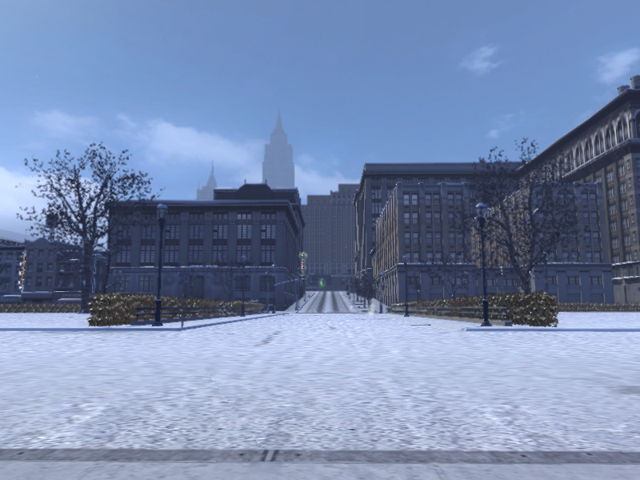 |
| DT05part04Distillery | 0.43221753835678 | 10:27 | FOGGY | 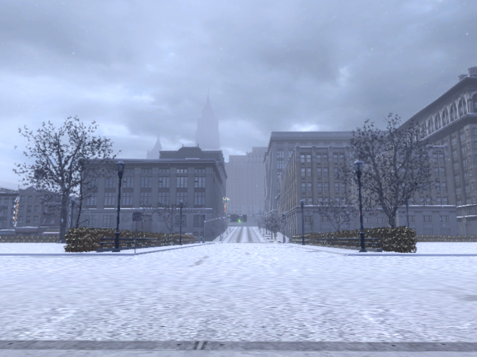 |
| DT05part03HarrysGunshop | 0.44025322794914 | 10:38 | CLEAR | 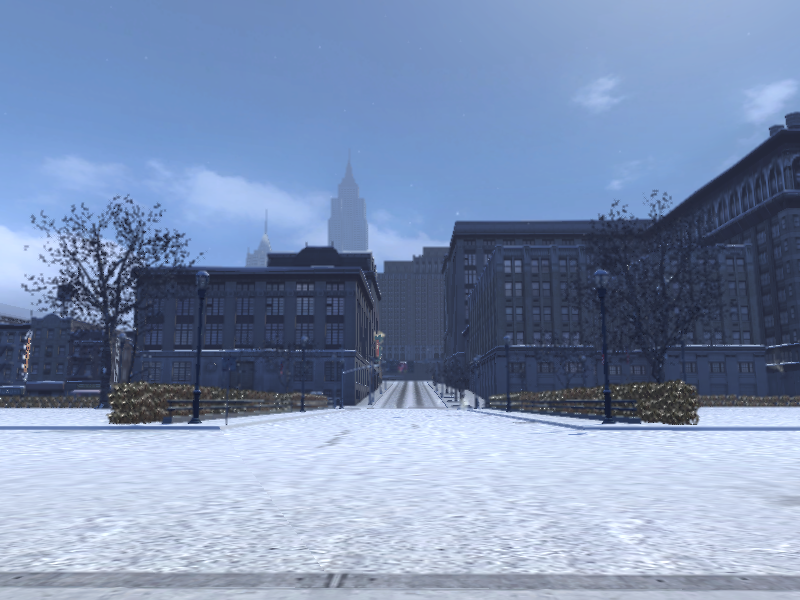 |
| DT03part01JoesFlat | 0.47142365574837 | 11:23 | CLEAR |  |
| DTFreeRideDayWinter | 0.5182166695594 | 12:31 | CLEAR | 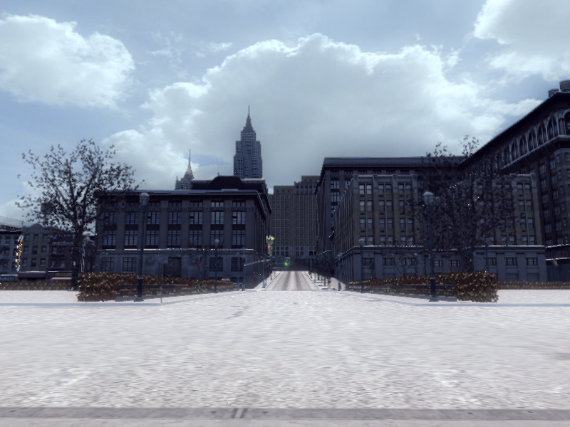 |
| DT05part05ElGreco | 0.58331775665283 | 14:05 | FOGGY | 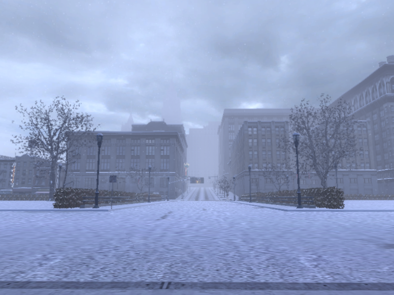 |
| DT02part01Railwaystation | 0.5887006521225 | 14:13 | CLEAR |  |
| DT04part01JoesFlat | 0.62531512975693 | 15:06 | FOGGY | 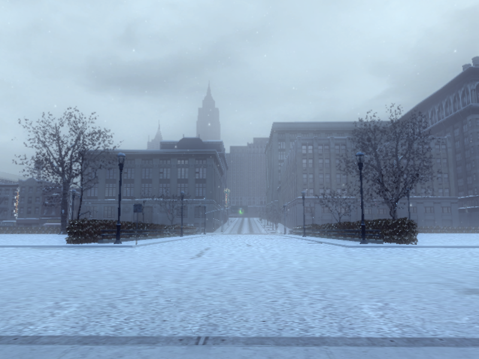 |
| DT02part02JoesFlat | 0.62701684236526 | 15:09 | CLEAR |  |
| DT03part02FreddysBar | 0.6465157866478 | 15:37 | FOGGY | 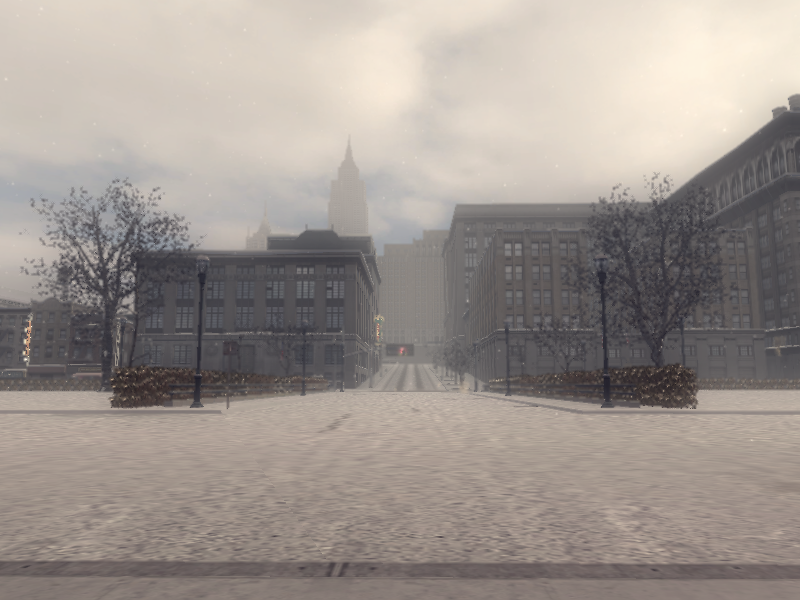 |
| DT02part03Charlie | 0.65608328580856 | 15:51 | FOGGY |  |
| DT02part04Giuseppe | 0.68752253055573 | 16:36 | CLEAR |  |
| DT05part06Francesca | 0.74392026662827 | 17:57 | CLEAR | 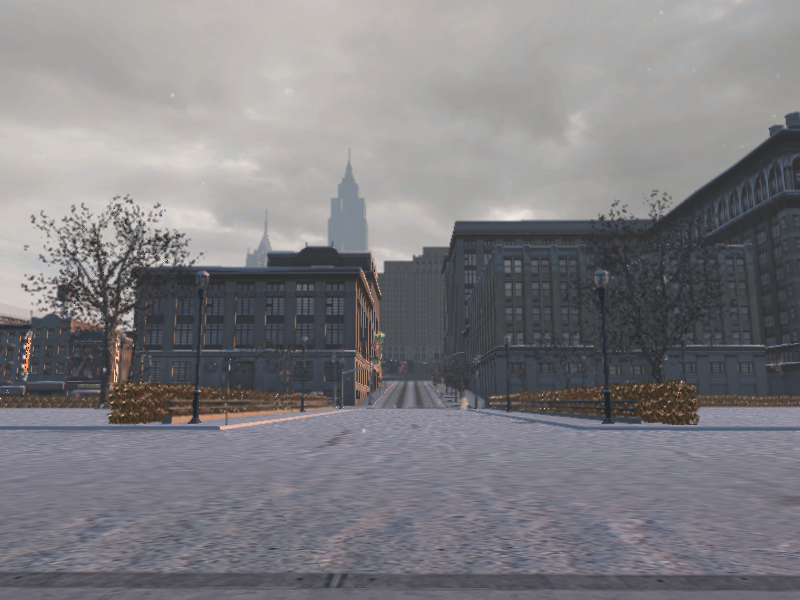 |
| DT02NewStart1 | 0.76822125911713 | 18:34 | CLEAR |  |
| DT03part03MariaAgnelo | 0.77371716499329 | 18:41 | CLEAR | 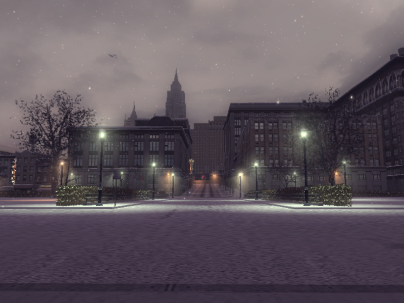 |
| DT02NewStart2 | 0.77647906541824 | 18:45 | CLEAR |  |
| DT02part05Derek | 0.78132635354996 | 18:52 | CLEAR |  |
| DT03part04PriceOffice | 0.81511825323105 | 19:42 | CLEAR | 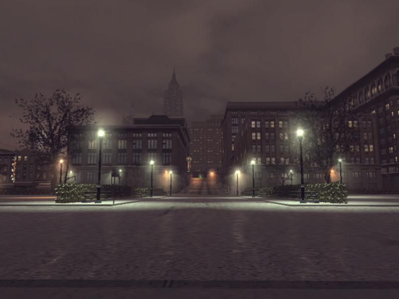 |
| DT04part02 | 0.9285181760788 | 22:25 | CLEAR | 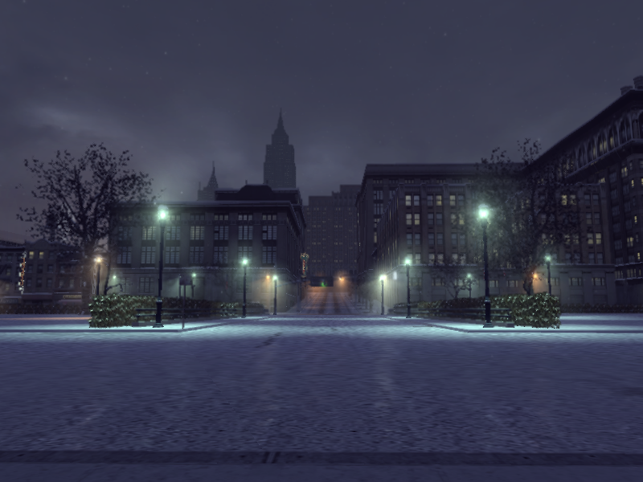 |
| DT05Distillery_inside | 0.98181742429733 | 23:42 | FOGGY | 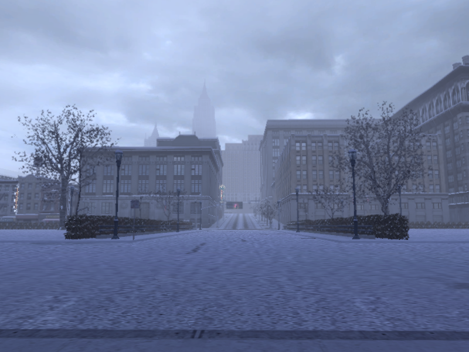 |